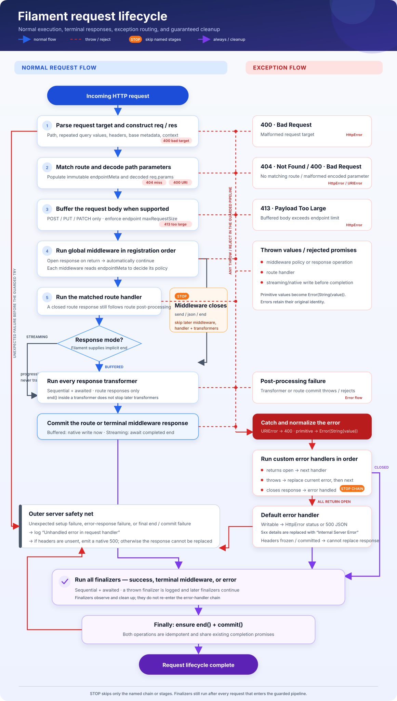

# Filament

A TypeScript API framework where each endpoint declares which application-wide
middleware behaviors apply. It serves a similar purpose to Express, with typed
endpoint rules that keep route policy visible beside the route handler.

## Why Filament?

### Best Features

- **Clear Endpoint Behavior**
  - Each endpoint declares which application-wide behaviors apply. See at a
    glance whether it requires authentication, records analytics, or enforces
    RBAC.
  - Endpoint rules are immutable, preventing middleware from accidentally
    changing route policy at runtime.
  - A shared TypeScript schema keeps endpoint declarations and middleware
    checks aligned.
- **Lightweight**
  - Zero production dependencies reduce supply-chain risk and simplify
    security audits.
  - A small, simple, and focused codebase designed for APIs and microservices.
- **Flexible**
  - Purposefully unopinionated.
  - Middleware, response transformers, error handlers, and finalizers provide
    extension points throughout the request lifecycle.
- **Observable**
  - Built-in, exporter-neutral telemetry collection.
  - Measure the latency impact of every middleware, route handler, and response transformer.
  - Per-endpoint configurability.
  - Timing and data collection is low-overhead and optional.

## Core Concepts

### 1. Endpoint Rules (`req.endpointMeta`)

Every endpoint receives a deeply frozen object describing its requirements and
behavior. Application-wide middleware reads `req.endpointMeta` to decide whether
and how its behavior applies to the matched endpoint.

```typescript
interface AppMeta extends FrameworkMeta {
  requiresAuth: boolean;
  rateLimit: number;
  logLevel: 'debug' | 'info' | 'error';
  tags: string[];
}
```

### 2. Defaults and Overrides

You provide a complete set of defaults when creating the application. Individual
endpoints override only the properties that differ. Nested plain objects merge;
arrays and other values replace their defaults.

### 3. Single Middleware Chain

All middleware runs in registration order. Each middleware is expected to inspect
`req.endpointMeta` and bows out when its policy does not apply. Returning with
an open response advances automatically; `send()`, `json()`, or `end()` makes
that middleware terminal.

Request context is a mutable, request-local overlay on immutable endpoint rules.
Policies that need the effective value of an overlapping setting can
use `contextGet(req, 'path.to.setting')`; it checks the complete path in
`req.context` first and falls back to `req.endpointMeta` when the path is absent.
An explicitly present context value, including `undefined`, takes precedence.

### 4. Response and Cleanup Hooks

Three dedicated hooks cover failures, buffered responses, and cleanup:

- **Error Handlers**: Handle failures while the response can still be replaced
- **Response Transformers**: Modify buffered route responses before commit
- **Finalizers**: Observe or clean up during the final lifecycle stage

## Installation

```bash
npm install filamentjs
```

## Quick Start

```typescript
import { createApp, type FrameworkMeta } from 'filamentjs';

// Define the rules every endpoint receives
interface AppMeta extends FrameworkMeta {
  requiresAuth: boolean;
  rateLimit: number;
  logLevel: 'debug' | 'info' | 'error';
  tags: string[];
}

// Supply complete defaults
const defaultMeta: AppMeta = {
  application: { maxRequestSize: '2MiB' },
  requiresAuth: false,
  rateLimit: 100,
  logLevel: 'info',
  tags: [],
};

// Create the application
const app = createApp<AppMeta>(defaultMeta, {});

// Define application-wide behavior
app.use(async (req, res) => {
  if (req.endpointMeta.requiresAuth) {
    const token = req.headers.get('Authorization');
    if (!token) {
      await res.status(401).json({ error: 'Unauthorized' });
      return;
    }
    // validate token...
  }
});

// Declare exceptions beside the endpoints that need them
app.get('/public', async (_req, res) => {
  await res.json({ message: 'Public endpoint' });
});

app.get('/admin', 
  { requiresAuth: true, logLevel: 'debug' },
  async (req, res) => {
    await res.json({ message: 'Admin panel' });
  }
);

// Start server
const port = await app.listen(3000);
```

## API Reference

### `createApp<T, C>(defaultMeta, defaultContext)`

```typescript
function createApp<
  T extends FrameworkMeta,
  C extends ContextMeta = ContextMeta,
>(defaultMeta: T, defaultContext: C): Application<T, C>
```

Creates an application with typed endpoint rules and mutable request context.

**Parameters:**

- `defaultMeta`: Complete implementation of your endpoint-rule interface
- `defaultContext`: Baseline context object, cloned for every request

**Returns:** Application instance

### Application Methods

#### HTTP Methods

```typescript
type RoutePart<T, C> = string | Partial<T> | AsyncRequestHandler<T, C>;

app.route(method: HttpMethod, ...parts: RoutePart<T, C>[]): void
app.get(...parts: RoutePart<T, C>[]): void
app.post(...parts: RoutePart<T, C>[]): void
app.put(...parts: RoutePart<T, C>[]): void
app.patch(...parts: RoutePart<T, C>[]): void
app.delete(...parts: RoutePart<T, C>[]): void
```

A registration accepts exactly one handler, one or more paths, and zero or more
endpoint overrides. Override objects merge in argument order. The convenience
methods cover the five methods shown above; `route()` also accepts `OPTIONS` and
`HEAD`. When multiple registrations match a request, the first one wins.

#### Route Contexts

```typescript
import { createRouteContext } from 'filamentjs';

const versions = createRouteContext(
  app,
  '/v1',
  '/v2',
  { requiresAuth: true },
);

versions.get('/users/:id', handler);
versions.route(['GET', 'HEAD'], '/health', healthHandler);
```

`createRouteContext()` groups routes under one or more base paths and shared
endpoint overrides. Every base path is combined with every local path. Shared
overrides apply first, so an individual route can override them. A route context
supports the same five convenience methods as the application, and its
`route()` method accepts one method or an array of methods.

#### Middleware Registration

```typescript
app.use(middleware: AsyncRequestHandler<T, C>): void
```

Middleware is application-wide by design. Use `req.endpointMeta` inside the
middleware to decide whether its behavior applies to the matched endpoint.

#### Request Context Lookup

```typescript
import { contextGet } from 'filamentjs';

const enabled = contextGet(req, 'analytics.enabled');
```

`contextGet()` resolves a complete dotted path against mutable `req.context`
first, then immutable `req.endpointMeta`. It returns `unknown`; an explicitly
present context value—including `undefined`, `null`, or `false`—takes
precedence.

#### Post-Request Handlers

```typescript
app.onError(handler: ErrorHandler<T, C>): void
app.onTransform(handler: ResponseTransformer<T, C>): void
app.onFinalize(handler: Finalizer<T, C>): void
```

Handlers of each kind run sequentially in registration order. An error handler
that returns with an open response advances to the next handler. Finalizers run
after Filament's commit attempt, cannot participate in normal response
processing, and are isolated from one another if one throws.

#### Server Control

```typescript
app.listen(port: number): Promise<number>
app.close(): Promise<void>
```

## Request Object

```typescript
interface Request<T extends FrameworkMeta, C extends ContextMeta> {
  method: HttpMethod;
  path: string;
  params: Record<string, string>;
  query: Record<string, string | string[]>;
  headers: Headers;
  body?: Buffer;
  endpointMeta: Readonly<T>;
  context: C;
}
```

## Response Object

```typescript
class Response {
  statusCode: number;
  readonly headers: Headers;
  readonly closed: boolean;
  readonly committed: boolean;
  streaming: boolean;
  get body(): Buffer | null;
  set body(content: string | Buffer);
  status(code: number): Response;
  json(data: unknown): Promise<void>;
  send(data: string | Buffer): Promise<void>;
  sendChunk(data: string | Buffer): Promise<void>;
  end(): Promise<void>;
  commit(): Promise<void>;
}
```

Read and mutate headers through `res.headers`, for example
`res.headers.set('Content-Type', 'text/plain')`.

Without response transformers, responses stream by default. Registering any
transformer makes buffered mode the default so the transformer can inspect and
replace the completed body. Set `res.streaming` before the first body operation
to override that default. `send()` and `json()` close the response;
`sendChunk()` leaves it open until `end()` is called. Filament normally calls
`commit()` itself after route processing.

## Request Lifecycle



```text
1. Parse the incoming request
   ↓
2. Route Matching → req.endpointMeta populated (readonly)
   ↓
3. Buffer POST, PUT, or PATCH body and enforce its size limit
   ↓
4. Middleware Chain (in registration order)
   - Each middleware inspects req.endpointMeta
   - Returning with an open response continues automatically
   - Closing stops later middleware, the route handler, and transformers
   ↓
5. Route Handler executes
   - Filament supplies an implicit end if the handler leaves it open
   ↓
6. [If Buffered] Response Transformers (sequential, awaited)
   - Streaming responses always skip transformers
   ↓
7. Filament commits the route response

Failures during parsing, routing, body buffering, middleware, route handling,
transformation, or commit enter the error flow. Custom error handlers run while
the response remains replaceable; failures after headers escape are logged.
Whether processing succeeds, closes early, or enters error handling, finalizers
run after Filament attempts to commit the response.
```

If middleware calls `send()`, `json()`, or `end()`, its response is terminal:
later middleware, the route handler, and transformers are skipped. A route
handler's closed response still proceeds through buffered transformers and
commit. Finalizers remain the always-run observation and cleanup stage.

## Observability Collection

Filament can gather request, response, and policy timing facts without choosing
a logger, metrics system, exporter, or transport. Enable collection in the
application defaults and consume the completed `ObservedInfo` in a finalizer:

```typescript
import { createApp, type ObservedInfo } from 'filamentjs';

const telemetryQueue: ObservedInfo[] = [];
const app = createApp({
  application: {
    maxRequestSize: '2MiB',
    observability: {
      enabled: true,
      success: { responseHeaders: true },
      failure: { statusText: true, responseBody: true },
      404: { requestHeaders: true },
    },
  },
}, {});

app.onFinalize(req => {
  const observed = req.context.application?.observed;
  if (observed) telemetryQueue.push(observed);
});
```

Every request receives `requestId` and `startTime` at
`req.context.application.observed`, even when detailed collection is disabled.
The request ID uses UTC and has the sortable form
`YYYYMMDD-HHmmss-mmmS-sssss`, where `S` is a same-millisecond sequence digit and
`sssss` is the server's five-character base-36 service ID. A Kubernetes
`POD_NAME` ending in
`-<10 lowercase alphanumerics>-<5 lowercase alphanumerics>` supplies the service
ID; other environments get a random one at server startup.

`ObservedInfo` contains those two required values plus optional `requestInfo`,
`responseInfo`, and `trace` sections. The corresponding request, response, and
trace-entry types are exported for consumers that process observations.

When enabled, `origin`, `method`, `path`, `search`, `statusCode`, and `trace`
default to true. Header/body fields and `statusText` default to false. Statuses
below 400 use `success`; statuses of 400 or greater use `failure`, which inherits
the effective success settings. An exact numeric status setting overrides its
outcome settings. Filament gathers the fields that any possible outcome may
need, then removes unrequested fields before finalizers run. Request context may
turn enabled fields off as processing progresses, or stop collection entirely:

```typescript
req.context.application ??= {};
req.context.application.observability = { enabled: false };
```

`origin` is the originating client IP. Filament prefers the standardized
`Forwarded` header, then `X-Forwarded-For`, then `X-Real-IP`, and finally the
socket's remote address. Deployments should only accept these forwarding
headers from proxies that overwrite or sanitize client-supplied values.

Trace entries use named function names when available. Anonymous middleware,
error handlers, and transformers receive stable ordinal labels; anonymous route
handlers use their method and route pattern. Collection ends when the response
is committed, so finalizer work is not added to the trace it consumes.

## Response Transformers

Transformers receive buffered route responses after the handler completes and
before commit:

```typescript
app.get('/report', async (_req, res) => {
  await res.json({ ready: true });
});

app.onTransform(async (_req, res) => {
  res.headers.set('X-Transformed', 'true');
});
```

Calling `json()`, `send()`, or `end()` in a route handler closes its response but
does not bypass buffered transformation. Streaming responses never transform.
Middleware-produced and error-flow responses bypass transformers entirely.

## Headers

Header names are case-insensitive. Filament presents them with conventional
HTTP casing, including exceptions such as `ETag`, `TE`,
`WWW-Authenticate`, `Sec-WebSocket-Key`, and `RateLimit-Remaining`.

`Headers.add()` preserves multiple field lines for list-valued fields and the
special `Set-Cookie` response field. Known singleton fields—such as
`Content-Length`, `Content-Type`, `Host`, `Location`, and `ETag`—use the last
value. Unknown fields default to repeatable. Use `setRepeatable()` or the
`Headers` constructor options to override that policy for application-specific
fields.

`get()` returns a string for a known singleton, an array for a repeatable field,
and `null` when an absent singleton is requested. Use `add()`, `set()`, and
`remove()` for individual fields; `addMany()`, `setMany()`, and `removeMany()`
provide bulk forms. Response headers remain mutable until they are sent.

## Route Matching and Path Parameters

Route paths support named parameters:

```typescript
app.get('/users/:id', {}, async (req, res) => {
  const userId = req.params.id;  // string
  await res.json({ userId });
});

app.get('/posts/:postId/comments/:commentId', {}, async (req, res) => {
  const { postId, commentId } = req.params;
  await res.json({ postId, commentId });
});
```

Static path text is matched literally, and parameter values are percent-decoded.
Paths must begin with `/` and match the entire request path. Filament does not
interpret wildcards, optional segments, or regular-expression syntax in route
strings. Register explicit paths when those forms are needed.

## Request Size Limit

`application.maxRequestSize` limits buffered POST, PUT, and PATCH request
bodies. It accepts a byte count or a case-insensitive byte-size string. Familiar
forms use binary multiples, so `2Mi`, `2MiB`, `2Mb`, and `2 MB` all normalize to
2097152 bytes. An oversized body enters the error flow as an exported
`HttpError` with status 413.

## Endpoint Rule Merging

- Endpoint rules are deeply cloned and merged with defaults
- Arrays **always replace** (not concatenate)
- Default and endpoint rules are deeply frozen at runtime

```typescript
const defaultMeta = {
  application: { maxRequestSize: '2MiB' },
  requiresAuth: false,
  tags: ['default'],
};
const app = createApp(defaultMeta, {});

app.get('/endpoint', 
  { requiresAuth: true, tags: ['custom'] }, // replaces the default tags
  handler
);
// req.endpointMeta:
// {
//   application: { maxRequestSize: 2097152 },
//   requiresAuth: true,
//   tags: ['custom'],
// }
```

## Error Handling

Failures during request parsing, route matching, body buffering, middleware,
route handling, response transformation, or commit enter the error flow:

```typescript
app.onError(async (err, req, res) => {
  console.error('Error:', err);
  await res.status(500).json({ error: err.message });
});
```

Routing failures use the same flow. Filament raises exported `HttpError`
instances for framework-detected failures such as malformed encoded parameters
(400), unmatched routes (404), and oversized request bodies (413). If a custom
error handler leaves the response open, Filament automatically tries the next
handler and eventually its default JSON response. Closing the response marks the
error as handled. If headers have already been sent by a streaming response,
Filament preserves the escaped response and logs the late error instead. Errors
thrown by finalizers are logged and do not prevent later finalizers from running.
The default handler preserves messages for statuses below 500 and returns
`Internal Server Error` for server failures.

## Complete Example

See [`src/example.ts`](src/example.ts) for a complete working example with:

- Authentication middleware
- A rate-limit configuration middleware stub
- Logging middleware
- Multiple endpoints with different rules
- Response transformers
- Error handling
- Finalizers

## Design Decisions

1. **Immutable Endpoint Rules**: `req.endpointMeta` is deeply frozen to prevent
   middleware from changing route policy
2. **Async by Default**: All handlers support `async/await`
3. **Registration Order**: Middleware runs in strict registration order
4. **Endpoint-Directed Scope**: Middleware uses endpoint rules to bow out
5. **Terminal Closure**: Closing a response skips normal downstream processing
6. **Path Parameters**: Typed as `Record<string, string>`
7. **Array Replacement**: Arrays in endpoint rules always replace (never merge)

## TypeScript

Full TypeScript support with strict typing:

- Generic `Application<T, C>` for typed endpoint rules and request context
- Type-safe request/response objects
- Compile-time validation of endpoint-rule interfaces

## Release Notes

### Version 0.6.0

Added mutable, request-local context, `contextGet()`, and optional observability
collection with request IDs and policy traces.

### Version 0.5.0

Added support for chunked responses. This came with significant rearchitecture,
including explicit streaming and buffered response modes. Because Filament is
still pre-1.0, this breaking change incremented the minor version.

### Version 0.4.0

The headers API changed, and names are now normalized to conventional HTTP
casing such as `If-Modified-Since` and `Content-Type`.

- `req.headers['content-type']` is now `req.headers.get('Content-Type')`
- `res.headers['content-type']` is now `res.headers.get('Content-Type')`

Headers are also now stored as tuples so they always appear in insertion order.

## License

ISC
